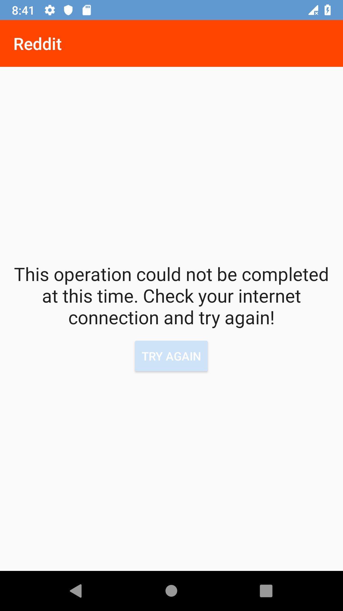
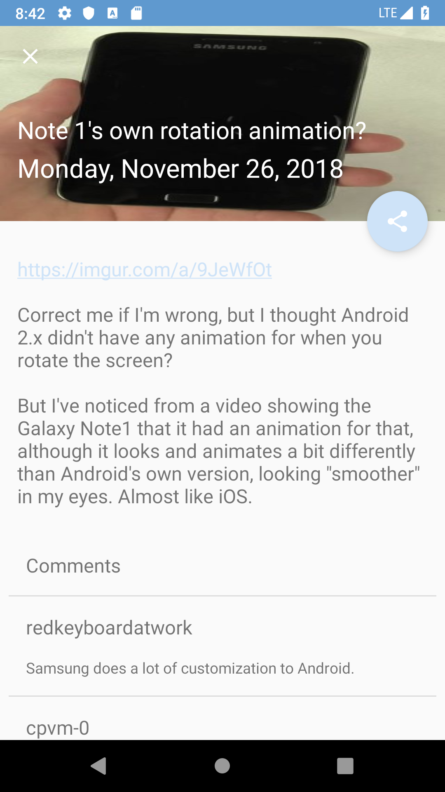
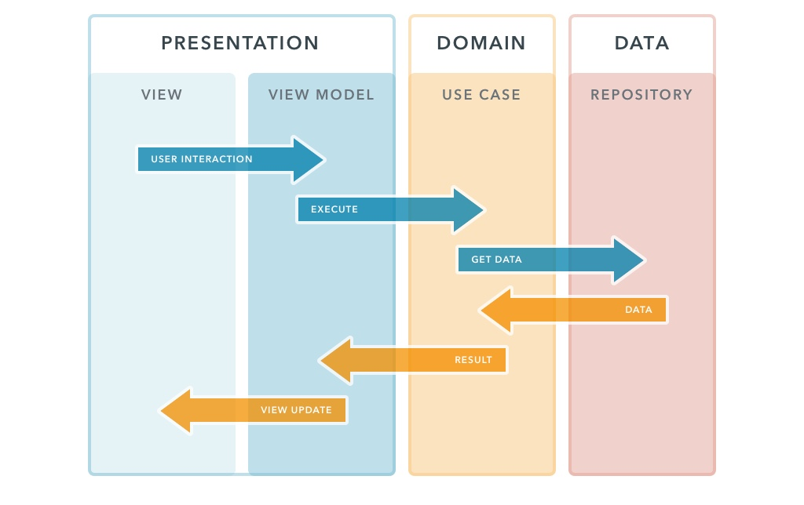

Supported language:  

# Summary
1. [Introduction](#introduction)
   * [Overview](#overview)
   * [Requirements](#requirements)
   * [Showcase](#showcase)
2. [Architecture](#architecture)
   * [Clean Architecture](#clean-architecture)
   * [Frameworks](#frameworks)
3. [TODO](#todo)  
4. [License](#license)

<a name="introduction" />

# Introduction

<a name="overview" />

## Overview

Reddit Application

 The requirements raised for this assignment shall test concepts of:
 1. Architectural design for Android Applications;
 2. Ability to communicate with complex end-points, parsing JSON responses and update UI;

<a name="showcase" />

## Showcase

  
  
  
  
    
  

<a name="architecture" />

# Architecture

Architecture
Uses concepts of the notorious Uncle Bob's architecture called Clean Architecture.
The software produced by this architecture is going to be:

Independent of Frameworks.
Testable.
Independent of UI.
Independent of Database.

<a name="clean-architecture" />
-----------------

Architectural approach
-----------------

<a name="frameworks" />

## Libraries and tools used in the project

### Android

* [Android Support Library](https://developer.android.com/topic/libraries/support-library/index.html)
Provides additional convenience classes and features not available in the standard Framework API for easier development and support across more devices.
* [Custom tab Library](https://developer.chrome.com/multidevice/android/customtabs)
Chrome Custom Tabs give apps more control over their web experience, and make transitions between native and web content more seamless without having to resort to a WebView.

### Architecture and Design

* [Android Architecture Components](https://developer.android.com/topic/libraries/architecture/index.html)
A collection of libraries that help you design robust, testable, and maintainable apps.
Start with classes for managing your UI component lifecycle and handling data persistence.

### Dependency injection
* [Koin](https://github.com/InsertKoinIO/koin)
A pragmatic lightweight dependency injection framework for Kotlin developers.

### Reactive

* [RX Java](https://github.com/ReactiveX/RxJava)
A library for composing asynchronous and event-based programs using observable sequences for the Java VM.
* [RX Kotlin](https://github.com/ReactiveX/RxKotlin)
RxJava bindings for Kotlin.
* [RX Android](https://github.com/ReactiveX/RxAndroid)
RxJava bindings for Android.

### View and Image

* [ConstraintLayout](https://developer.android.com/training/constraint-layout/index.html)
Allows you to create large and complex layouts with a flat view hierarchy (no nested view groups).
* [RecyclerView](http://developer.android.com/reference/android/support/v7/widget/RecyclerView.html)
A flexible view for providing a limited window into a large data set.
* [Glide](https://github.com/bumptech/glide)
An image loading and caching library for Android focused on smooth scrolling

### Data Request

* [Retrofit](http://square.github.io/retrofit/)
A type-safe HTTP client for Android and Kotlin.
* [OkHttp](http://square.github.io/okhttp/)
An HTTP & HTTP/2 client for Android and Kotlin applications.
* [Gson](https://github.com/square/retrofit/tree/master/retrofit-converters/gson)
A Converter which uses Gson for serialization to and from JSON..

### Tests
* [Junit](https://junit.org))
JUnit is a unit testing framework for the Java programming language.
* [Mockito](https://github.com/nhaarman/mockito-kotlin)
A small library that provides helper functions to work with Mockito in Kotlin.
* [kluent](https://github.com/MarkusAmshove/Kluent)
Kluent is a "Fluent Assertions" library written specifically for Kotlin.
* [kakao](https://github.com/agoda-com/Kakao)
Nice and simple DSL for Espresso in Kotlin

## TODO

* [Explain more about the architecture diagrams in README file.](#)
* [Improve and add more unit and instrumentation tests](#)
* [Improve viewmodel to more reactive like add behaviours](#)
* [Add static analysis tools](#)
* [Add CI](#)
* [Add jacoco to generate report about code coverage](#)

<a name="license" />

## License
Copyright 2018 Uzias Santos Ferreira

Licensed under the Apache License, Version 2.0 (the "License");
you may not use this file except in compliance with the License.
You may obtain a copy of the License at

    http://www.apache.org/licenses/LICENSE-2.0

Unless required by applicable law or agreed to in writing, software
distributed under the License is distributed on an "AS IS" BASIS,
WITHOUT WARRANTIES OR CONDITIONS OF ANY KIND, either express or implied.
See the License for the specific language governing permissions and
limitations under the License.